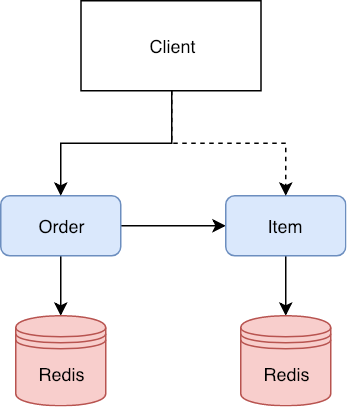
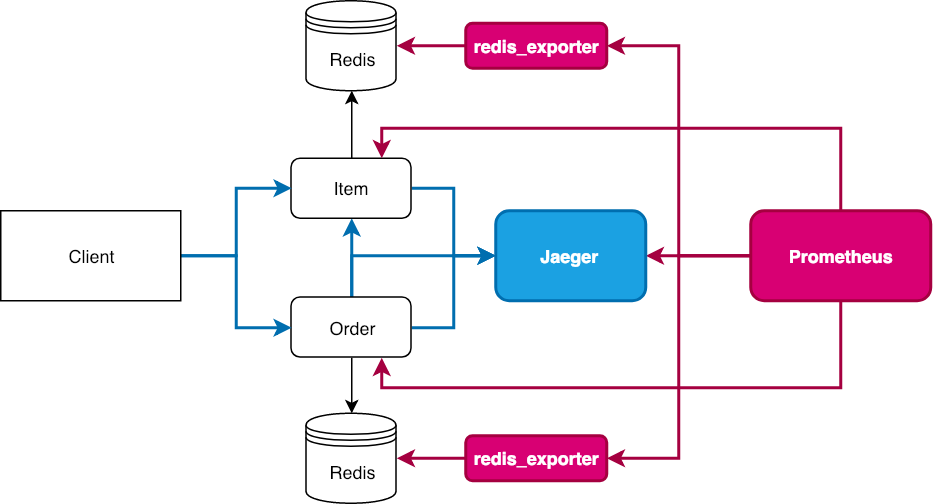
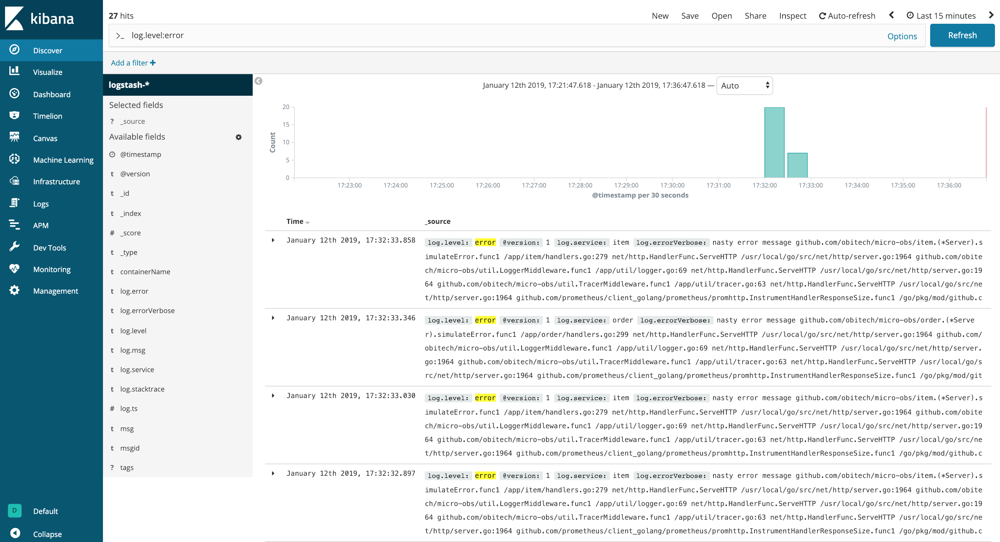
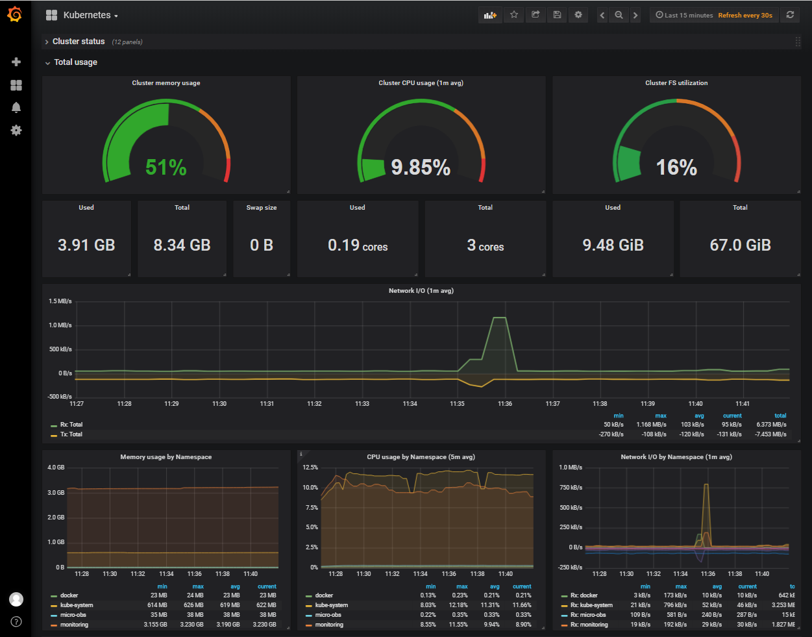

# gomicro-obs

[](https://travis-ci.org/naviat/gomicro-obs) [](https://goreportcard.com/report/github.com/naviat/gomicro-obs) [](https://hub.docker.com/r/naviat/gomicro-obs)

## Contents

  - [Overview](#overview)
  - [Build it](#build-it)
  - [Deploy it](#deploy-it)
    - [Docker](#docker)
    - [Kubernetes](#kubernetes)
  - [Use it](#use-it)
    - [Docker](#docker-1)
      - [Preparation](#preparation)
      - [Jaeger](#jaeger)
      - [Prometheus](#prometheus)
      - [ELK](#elk)
    - [Kubernetes](#kubernetes-1)
      - [Preparation](#preparation)
      - [Jaeger](#jaeger-1)
      - [Prometheus](#prometheus-1)
      - [ELK](#elk-1)
  - [item](#item)
  - [order](#order)
  - [util](#util)
  - [License](#license)

## Overview

Example of instrumenting a Go microservices application:

- Structured logging via [zap](https://github.com/uber-go/zap)
- Automatic endpoint monitoring exposing metrics to [Prometheus](https://github.com/prometheus/prometheus)
- Internal & distributed tracing via [Jaeger](https://github.com/jaegertracing/jaeger)

Deployments can be made via Docker and on Kubernetes. Additional instrumentation:

- Monitoring of demo app and internal Kubernetes components via [Prometheus Operator](https://github.com/coreos/prometheus-operator)
- Automatic container log aggregation via [ELK Stack](https://www.elastic.co/elk-stack)

The example application consists of two services: `item` and `order`. Both service have a seperate [redis](https://redis.io) instance as their primary data store. When an order gets placed, `order` contacts `item` to check if the wished items with the requested quantities are in stock:



API endpoints of both services are instrumented via Prometheus and export the following metrics:

- `in_flight_requests`: a gauge of requests currently being served by the wrapped handler
- `api_requests_total`: a counter for requests to the wrapped handler
- `request_duration_seconds`: a histogram for request latencies
- `response_size_bytes`: a histogram for response sizes

Additionally, all requests are traced via Jaeger:



On Kubernetes, next to the application and node-specific metrics exposed via [node_exporter](https://github.com/prometheus/node_exporter), internal Kubernetes components are monitored as well:

- `kube-apiserver`
- `kube-dns`
- `etcd`
- `kube-controller-manager`
- `kube-scheduler`
- `kubelet`
- [`kube-state-metrics`](https://github.com/kubernetes/kube-state-metrics)

Proemtheus is fully managed via the Prometheus Operator, allowing flexible deployment of new instances, rules, alertmanagers as well as convenient monitoring of Services via ServiceMonitors. A [Mailhog](https://github.com/mailhog/MailHog) instance is deployed to test the alerting pipeline.

For the ELK Stack, a Filebeat DaemonSet is watching all container logs on the nodes.


## Build it

To build it from source you need [Go 1.11+](https://golang.org/dl/) installed.

This project uses [Go Modules](https://github.com/golang/go/wiki/Modules) so you can clone the repo to anywhere:

```bash
git clone https://github.com/naviat/gomicro-obs.git
cd micro-obs/
```

Run `make` to test & build it:

```bash
make
# ...
```

Or `make docker` to build a Docker image:

```bash
make docker TAG=yourname/yourimage
# ...
```

## Deploy it

### Docker

Make sure [Docker](https://docs.docker.com/install/) and [Docker Compose](https://docs.docker.com/compose/install/) are installed.

Deploy the stack:

```bash
cd deploy/docker
docker-compose up -d
```

### Kubernetes

Make sure [Docker](https://docs.docker.com/install/) and Kubernets (via [Minikube](https://github.com/kubernetes/minikube) or [microk8s](https://microk8s.io), for example) are installed.

Deploy the `monitoring` stack first:

```bash
kubectl create -f deploy/k8s/000-monitoring --recursive
```

It might take a while for the [Prometheus Operator](https://github.com/coreos/prometheus-operator) CRDs to be created. If the deployment fails, try running above command again.

Check if everything is up:

```
$ kubectl get pods -n monitoring
NAME                                   READY     STATUS    RESTARTS   AGE
alertmanager-main-0                    2/2       Running   0          1m
elasticsearch-f8dc4db44-l7ddn          2/2       Running   0          1m
filebeat-pnx76                         2/2       Running   0          1m
grafana-5bfbfb9665-nf9c9               1/1       Running   0          1m
jaeger-deployment-ff5c4dccc-tfxns      1/1       Running   0          1m
kibana-86c4b5577b-dxtpf                1/1       Running   0          1m
kube-state-metrics-58dcbb8579-hsw78    4/4       Running   0          1m
logstash-74479c885f-5lfcw              1/1       Running   0          1m
mailhog-778bd8484d-8vqfg               1/1       Running   0          1m
node-exporter-swtd6                    2/2       Running   0          1m
prometheus-core-0                      3/3       Running   0          1m
prometheus-operator-85bb8dc95b-wqpx6   1/1       Running   0          1m
```

Next deploy `micro-obs` stack:

```bash
kubectl create -f deploy/k8s/100-micro-obs/ --recursive
```

Check if everything is up:

```
$ kubectl get pods -n micro-obs
NAME                           READY     STATUS    RESTARTS   AGE
item-54d9d7d554-2thtl          1/1       Running   0          1m
order-6549584969-k2cp8         1/1       Running   0          1m
redis-item-5bcf99c9f7-zdf2r    2/2       Running   0          1m
redis-order-68869c7986-4s7w2   2/2       Running   0          1m
```

## Use it

First build the `dummy` CLI application:

```make
make build-dummy
```

### Docker

Service|Location
---|---
item API|http://localhost:8080/
order API|http://localhost:8090/
Jaeger Query|http://localhost:16686/
Prometheus|http://localhost:9090/
Grafana|http://localhost:3000/

#### Preparation

Create some dummy data:

```
./bin/dummy data all
```

#### Jaeger

After creating dummy data, those transactions can be found in the Jaeger Query UI at http://localhost:16686:


#### Prometheus

Send some dummy requests:

```
./bin/dummy requests all / /aksdasd /items /orders /delay /error -n 100 -c 5 
```

Start Grafana and upload the `deploy/docker/dashboards/micro-obs.json` dashboard:


#### ELK

After sending some requests, logs can be queried via Kibana running on http://localhost:5601:



### Kubernetes

Service|Location|Internal FQDN
---|---|---
item API|http://localhost:30808|http://item.micro-obs.service.cluster.local:8080
item Redis|.|redis-item.micro-obs.service.cluster.local:3879
order API|http://localhost:30809|http://order.micro-obs.service.cluster.local:8090
order Redis|.|http://redis-order.micro-obs.service.cluster.local:3879
Jaeger Query|http://localhost:30686|.
Prometheus|http://localhost:30900|http://prometheus.monitoring.svc.cluster.local:9090
Grafana|http://localhost:30300|.
ElasticSearch|.|http://elasticsearch.monitoring.svc.cluster.local:9200
Kibana|http://localhost:30601|.
Mailhog|http://localhost:32025|mailhog.svc.cluster.local:1025

#### Preparation

Create some dummy data:

```
./bin/dummy data all -i http://localhost:30808 -o http://localhost:30809
```

#### Jaeger

After creating the dummy data, those transactions can be found in the Jaeger Query UI at http://localhost:30686:


#### Prometheus

Both the Kubernetes' internal components as well as the `micro-obs` application (TODO) is being monitored by Prometheus. Some pre-installed Dashboards can be found in Grafana via http://localhost:30300 (default login is admin:admin):



#### ELK

TODO

## [item](https://godoc.org/github.com/naviat/gomicro-obs/item)
[](https://godoc.org/github.com/naviat/gomicro-obs/item) 

Method|Endpoint|Comment
---|---|---
GET|`/healthz`|Returns `OK` as string
GET|`/ping`|Returns a standard API response
GET|`/items`|Returns all items
GET|`/items/{id:[a-zA-Z0-9]+}`|Returns a single item by ID
DELETE|`/items/{id:[a-zA-Z0-9]+}`|Deletes a single item by ID
POST|`/items`|Sends a JSON body to create a new item. Will not update if item already exists
PUT|`/items`|Sends a JSON body to create or update an item. Will update existing item

Request:

```json
POST http://localhost:8080/items
[
	{
		"name": "banana",
		"desc": "a yello fruit",
		"qty": 5
	},
	{
		"name": "water",
		"desc": "bottles of water",
		"qty": 10
	},
	{
		"name": "apple",
		"desc": "delicious",
		"qty": 15
	}
]
```

Response:

```json
{
    "status": 201,
    "message": "items BxYs9DiGaIMXuakIxX, GWkUo1hE3u7vTxR, JAQU27CQrTkQCNr,  created",
    "count": 3,
    "data": [
        {
            "name": "banana",
            "id": "BxYs9DiGaIMXuakIxX",
            "desc": "a yello fruit",
            "qty": 5
        },
        {
            "name": "water",
            "id": "GWkUo1hE3u7vTxR",
            "desc": "bottles of water",
            "qty": 10
        },
        {
            "name": "apple",
            "id": "JAQU27CQrTkQCNr",
            "desc": "delicious",
            "qty": 15
        }
    ]
}
```

## [order](https://godoc.org/github.com/naviat/gomicro-obs/order)
[](https://godoc.org/github.com/naviat/gomicro-obs/order) 

Method|Endpoint|Comment
---|---|---
GET|`/healthz`|Returns `OK` as string
GET|`/ping`|Returns a standard API response
GET|`/orders`|Returns all orders
GET|`/orders/{id:[0-9]+}`|Returns a single order by ID
DELETE|`/orders/{id:[a-zA-Z0-9]+}`|Deletes a single order by ID
POST|`/orders/create`|Creates a new order. Will query the `item` service first to check if passed items exist and are present in the wished quantity

Request:

```json
POST http://localhost:8090/orders/create
{
	"items": [
		{
			"id": "BxYs9DiGaIMXuakIxX",
			"qty": 2
		},
		{
			"id": "GWkUo1hE3u7vTxR",
			"qty": 8
		}
	]
}
```

Response:

```json
{
    "status": 201,
    "message": "order 1 created",
    "count": 1,
    "data": [
        {
            "id": 1,
            "items": [
                {
                    "id": "BxYs9DiGaIMXuakIxX",
                    "qty": 2
                },
                {
                    "id": "GWkUo1hE3u7vTxR",
                    "qty": 8
                }
            ]
        }
    ]
}
```

## [util](https://godoc.org/github.com/naviat/gomicro-obs/util)
[](https://godoc.org/github.com/naviat/gomicro-obs/util) 

## License

[MIT](https://spdx.org/licenses/MIT.html)